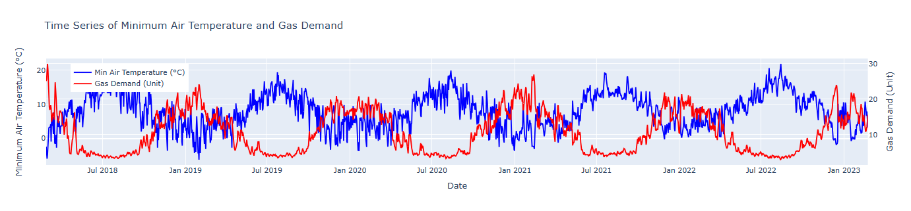
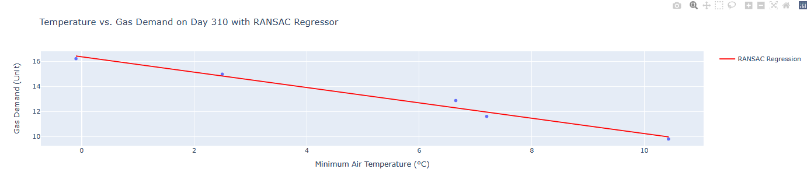
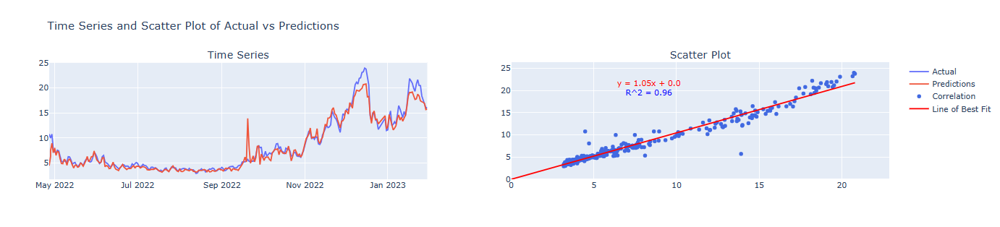

# Time Series Analysis of Gas Demand

## Introduction

This project develops an algorithm to predict the natural gas demand in a specific region throughout the year, utilizing publicly available data from the UK's National Grid and weather data from the NOAA (National Oceanic and Atmospheric Administration). The hypothesis is that natural gas demand is predictable, heavily influenced by ambient weather conditions.

### Data Sources

The following datasets are essential for this project:

1. **Gas Demand Data from National Grid**: Represents the entire region's natural gas supply.
2. **Weather Data from NOAA**: Covers the region through approximately 25 grids per region.

Access the data here:
- NOAA Weather Data: [NOAA Weather](https://www.noaa.gov/weather)
- National Grid Gas Reports: [National Grid Reports](https://data.nationalgas.com/reports/find-gas-reports)

By analyzing these datasets, we can model UK gas demand based on various factors like weather conditions and time of year.

## Data Exploration

Analysis indicates a direct correlation between weather conditions, specifically air temperature, and natural gas demand in reg in a given day of the yearions like East Anglia. For example, data from 2018-2023 shows a linear relationship between minimum air temperatures and daily gas demand:



Figure provides further insight when looking at the gas demand vs. air temperature for a specific day of the year.



This relationship is influenced by several factors:
- Manual adjustments by operators in control rooms.
- Consumer demand affecting gas release.
- System inefficiencies, often described as "leaky" or sieve-like, complicating precise gas regulation.
- Operators use historic data to forecast demand based on temperature.

## Model Building

The modeling process was structured as follows:

1. **Initial Linear Regression**: Applied RANSAC linear regression to predict daily demand based on `airTemperature_min` for each grid.
2. **Machine Learning Model**: Built upon the initial regression with comprehensive weather data to develop a robust time series machine learning model.

### Explored Machine Learning Models

We experimented with several models, tracking their performance using MLflow:
- XGBoost Random Forest
- Gradient Boosted Machines
- LSTM Neural Network
- GRU Neural Network
- KNN

Key performance metrics included R2 score, gradient analysis, residuals, MSE, and MAE. The LSTM model proved superior due to its ability to manage sequential data effectively, benefiting from features like regularization and dropout layers to mitigate overfitting, a common issue in smaller datasets.

## Results

The LSTM model's parameters and results are outlined below:

```python
epochs = 5000
sequence_length = 15
learning_rate = 0.001
dropout = 0.1
weight_decay = 0.01

lstm_trainer = LSTMTimeSeriesTrainer(dropout=dropout, weight_decay=weight_decay)
lstm_trainer.train(X_train, y_train, epochs=epochs, sequence_length=sequence_length, lr=learning_rate)

```
The final LSTM model metrics:




| Metric         | Value     |
|----------------|-----------|
| **R2 Score**   | `0.96`    |
| **MSE**        | `0.62`    |
| **MAE**        | `1.08`    |
| **Residuals**  | `222`     |


